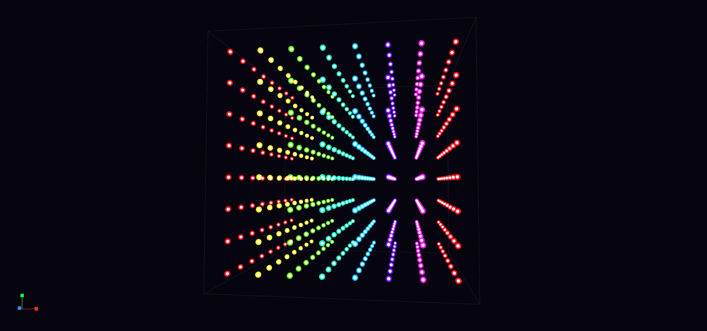
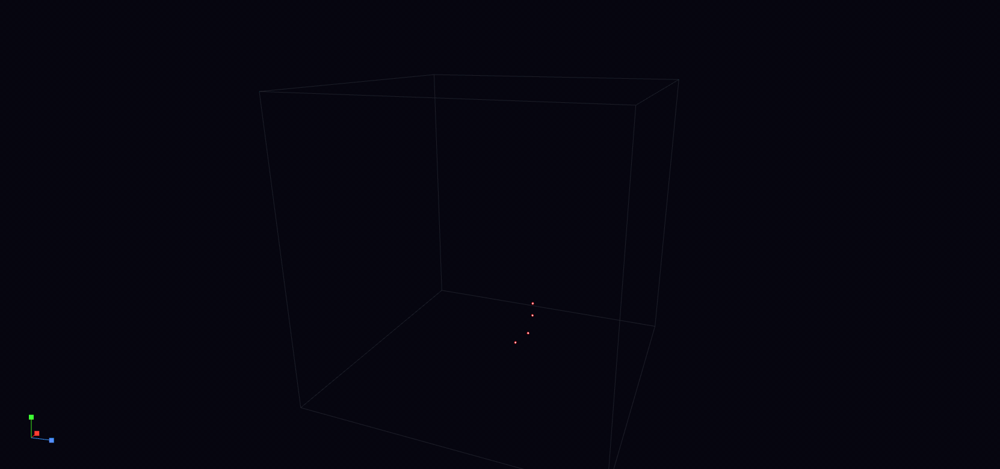

# Scintilla

> **Status:** Active
> **Provenance:** Shane Hartley (owner) · Claude (architect, prototype, documentation)
> **Last reviewed:** 2026-05-29
> **Why this status:** Phases 0–8 complete — renderer, editor, audio reactive engine, Python preset + animation scripting, paint-tool polish, animation export, and the user manual are all in place. Future phases cover extended exports and shapes; see [ROADMAP.md](ROADMAP.md).

A 3D LED array designer that dances to your music. Spiritual successor to the physical
[8×8×8 LED Cube](https://github.com/Darian-Frey/LED_Cube) (2009), removing all hardware constraints — arbitrary grid sizes (3³–32³), full RGB per voxel, multiple array shapes, a frame-based animation timeline, music-reactive playback via PortAudio + KissFFT, and a Python preset scripting engine inspired by Winamp AVS.

<p align="center">
  
  <br><em>Audio-reactive plasma preset, 8³ grid</em>
</p>

<p align="center">
  
  <br><em>Lorenz attractor animation script, 25³ grid</em>
</p>

## Features

- 3D voxel viewport with orbit/pan/zoom camera and camera-keyframe fly-throughs
- Four LED array shapes: Cube, Sphere, Cylinder, Pyramid
- Grid sizes 3³–32³ with instanced-mesh rendering
- Full RGB + per-LED brightness; palette + recent-history colour picker
- Paint / Erase / Fill / Pick tools with stroke painting and X/Y/Z mirror modes
- Undo / Redo, copy / paste across frames, right-click LED edit
- X/Y/Z slice view for layer editing
- Frame-based animation timeline with playback and FPS / mode controls
- JSON save/load plus MP4 / GIF / WebM / PNG-sequence export via ffmpeg
- Audio-reactive modes via PortAudio + KissFFT — 8 built-in modes plus live Python presets
- Python preset scripting with hot-reload and in-app editor
- Animation scripts (`cube.frame()` / `cube.play()`) for non-reactive programmatic animations
- 20 built-in presets / animations across six visual categories

See [FEATURES.md](FEATURES.md) for the full capability list with priorities and acceptance criteria, and [USER_MANUAL.md](USER_MANUAL.md) for an end-user tour.

## Quick start

### Prototype (browser)

```bash
xdg-open prototype/index.html    # or open in any modern browser
```

No build step required; the prototype is the canonical renderer reference.

### Desktop build

```bash
# Install dependencies — see BUILD.md for per-platform details
sudo apt install -y build-essential cmake ninja-build \
    qt6-base-dev libqt6opengl6-dev libgl1-mesa-dev \
    portaudio19-dev python3 python3-numpy ffmpeg

# Build and run
cmake -B build -G Ninja
cmake --build build
./build/Scintilla
```

`ffmpeg` is only required for animation export (MP4 / GIF / WebM). See [USER_MANUAL.md](USER_MANUAL.md) for a walkthrough of every program feature and [ROADMAP.md](ROADMAP.md) for completed and upcoming phases.

## Project structure

```text
.
├── CLAUDE.md, HANDOVER.md       ← AI handoff documents (current state, build order)
├── README.md, FEATURES.md, ROADMAP.md, CHANGELOG.md
├── ARCHITECTURE.md, DECISIONS.md, BUILD.md, ATTACK_VECTORS.md
├── CMakeLists.txt               ← build system (Qt6, PortAudio, KissFFT)
├── LICENSE                      ← MIT (DEC-026)
├── docs/
│   ├── SPEC.md                  ← full feature specification
│   └── D-00N-*.md               ← thematic decision logs (DEC-001 … DEC-023)
├── src/                         ← C++20 source tree
│   ├── core/                    ← VoxelFrame, ShapeMask, AnimationTimeline, JsonSerializer
│   ├── renderer/                ← CubeViewport (QOpenGLWidget), shaders, OrbitCamera
│   ├── audio/                   ← PortAudio + KissFFT pipeline
│   ├── scripting/               ← Python preset runner (QProcess)
│   └── ui/                      ← Qt widgets (colour picker, timeline, slice control)
├── presets/                     ← Python preset runtime
│   ├── led_cube/                ← preset base class + CubeProxy
│   ├── builtin/                 ← shipped presets (target: 20)
│   └── user/                    ← user-authored presets
└── prototype/index.html         ← Three.js r128 reference prototype
```

## Documentation

| File | Purpose |
| --- | --- |
| [USER_MANUAL.md](USER_MANUAL.md) | End-user tour of every program feature, keyboard shortcuts, troubleshooting |
| [presets/INSTRUCTIONS.md](presets/INSTRUCTIONS.md) | Python preset and animation-script authoring guide |
| [CLAUDE.md](CLAUDE.md) | AI development handoff — current state, conventions, invariants |
| [HANDOVER.md](HANDOVER.md) | Recommended build order, missing-files inventory |
| [FEATURES.md](FEATURES.md) | Capability list with priorities and acceptance criteria (F-NNN) |
| [ROADMAP.md](ROADMAP.md) | Phased development plan (Phases 0–8 complete, Phase 9+ planned) |
| [ARCHITECTURE.md](ARCHITECTURE.md) | System structure, module responsibilities, threading model |
| [DECISIONS.md](DECISIONS.md) | Indexed log of design decisions (DEC-NNN), reversal conditions |
| [BUILD.md](BUILD.md) | Toolchain, dependencies, build commands, troubleshooting |
| [ATTACK_VECTORS.md](ATTACK_VECTORS.md) | Project-specific failure modes (AV-NNN), detection methods |
| [BUGS.md](BUGS.md) | Catalogue of realised bugs (BUG-NNN), open / fixed / wontfix / deferred |
| [IMPROVEMENTS.md](IMPROVEMENTS.md) | Catalogue of code-quality improvements (IMP-NNN), suggested / applied / declined / deferred |
| [CHANGELOG.md](CHANGELOG.md) | Version history |
| [docs/SPEC.md](docs/SPEC.md) | Authoritative feature specification |

## License

MIT — see [LICENSE](LICENSE) and [DECISIONS.md](DECISIONS.md) DEC-026.
